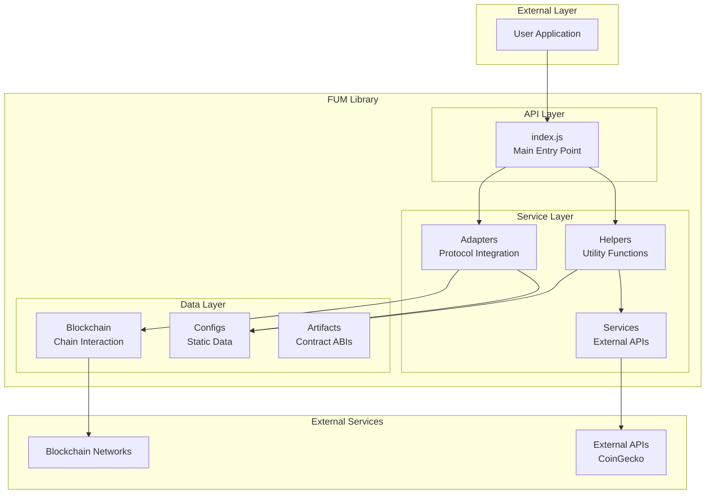
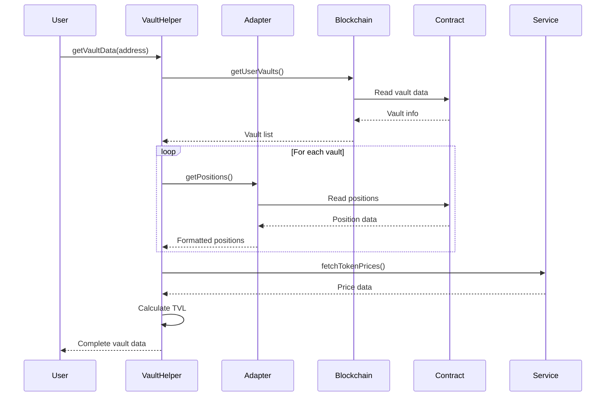
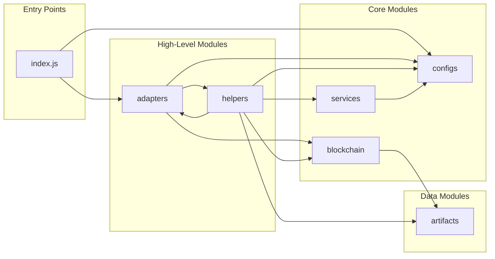

# FUM Library Architecture

## Overview

The FUM (Fund Unified Management) Library is a modular DeFi integration framework designed to provide a unified interface for interacting with various decentralized finance protocols. This document describes the architecture, design patterns, and module interactions within the library.

## Table of Contents

1. [Architecture Overview](#architecture-overview)
2. [Module Structure](#module-structure)
3. [Core Components](#core-components)
4. [Design Patterns](#design-patterns)
5. [Data Flow](#data-flow)
6. [Module Dependencies](#module-dependencies)

## Architecture Overview



## Module Structure

### Directory Layout

```
src/
└── index.js # FUM Library - Main Entry Point
├── adapters/
│   ├── index.js # Adapter system for DeFi platforms
│   ├── AdapterFactory.js # @module adapters/AdapterFactory
│   ├── PlatformAdapter.js # Base class for DeFi platform adapters.
│   └── UniswapV3Adapter.js # UniswapV3Adapter - Uniswap V3 Protocol Integration
├── artifacts/
│   └── contracts.js # Contract ABIs and addresses for the F.U.M. project
├── blockchain/
│   ├── index.js # Blockchain Module - Ethereum Interaction Utilities
│   ├── contracts.js # @module blockchain/contracts
│   └── wallet.js # @module blockchain/wallet
├── configs/
│   ├── index.js
│   ├── chains.js # Chain configuration for F.U.M. project
│   ├── platforms.js # Platform configuration for F.U.M. project
│   ├── strategies.js # Strategy configuration with templates and parameters
│   └── tokens.js # Token configuration with addresses on multiple chains
├── helpers/
│   ├── index.js
│   ├── chainHelpers.js # @module helpers/chainHelpers
│   ├── formatHelpers.js # @module helpers/formatHelpers
│   ├── platformHelpers.js # @module helpers/platformHelpers
│   ├── strategyHelpers.js # @module helpers/strategyHelpers
│   └── tokenHelpers.js # @module helpers/tokenHelpers
├── services/
│   ├── index.js
│   └── coingecko.js # @module services/coingecko
```

## Core Components

### 1. Adapters Module

The adapters module provides a unified interface for interacting with different DeFi protocols.

**Key Components:**
- `PlatformAdapter`: Abstract base class defining the interface all adapters must implement
- `UniswapV3Adapter`: Concrete implementation for Uniswap V3 protocol
- `AdapterFactory`: Factory pattern implementation for creating platform-specific adapters

**Design Pattern:** Factory Pattern with Abstract Base Class

### 2. Blockchain Module

Handles all direct blockchain interactions including wallet management and contract calls.

**Key Components:**
- `wallet.js`: Provider creation and wallet connection management
- `contracts.js`: Smart contract interaction utilities

**Features:**
- Multi-chain support
- Provider abstraction
- Transaction management

### 3. Configs Module

Static configuration data for the library.

**Components:**
- `chains.js`: Blockchain network configurations
- `platforms.js`: DeFi platform metadata
- `strategies.js`: Trading strategy definitions
- `tokens.js`: Token information and addresses

### 4. Helpers Module

Utility functions that provide common functionality across the library.

**Components:**
- `chainHelpers.js`: Chain-specific utilities
- `formatHelpers.js`: Number and string formatting
- `platformHelpers.js`: Platform data access
- `strategyHelpers.js`: Strategy validation and management
- `tokenHelpers.js`: Token data management
- `vaultHelpers.js`: Vault position calculations

### 5. Services Module

External API integrations.

**Components:**
- `coingecko.js`: Price data fetching with caching

### 6. Artifacts Module

Contract ABIs and deployment addresses.

## Design Patterns

### 1. Factory Pattern
Used in `AdapterFactory` to create platform-specific adapter instances.

### 2. Adapter Pattern
Each platform adapter implements a common interface, allowing uniform interaction with different protocols.

### 3. Module Pattern
Each module exports specific functionality while encapsulating implementation details.

### 4. Singleton Pattern
Configuration objects and caches are implemented as singletons.

## Data Flow

### Position Fetching Flow



## Module Dependencies

### Dependency Graph



### Circular Dependencies
The library avoids circular dependencies through careful module design and the use of dependency injection where necessary.

## Configuration Management

The library uses a layered configuration approach:

1. **Static Configs**: Hard-coded in `configs/` modules
2. **Runtime Configs**: Passed through function parameters
3. **Environment Configs**: Read from environment variables (API keys)

## Error Handling

The library implements consistent error handling:

1. **Validation Errors**: Thrown immediately with descriptive messages
2. **Network Errors**: Caught and logged, graceful degradation
3. **Data Errors**: Return partial data with `hasPartialData` flags

## Performance Considerations

1. **Caching**: Price data cached for 60 seconds
2. **Batch Operations**: Multiple positions fetched in parallel
3. **Lazy Loading**: Contract instances created on demand
4. **Data Prefetching**: Token prices prefetched before calculations

## Security Considerations

1. **Input Validation**: All user inputs validated
2. **Address Checksums**: Ethereum addresses validated
3. **Slippage Protection**: Built into swap operations
4. **No Private Key Storage**: Library never stores private keys

## Extension Points

The library is designed for extensibility:

1. **New Adapters**: Implement `PlatformAdapter` interface
2. **New Strategies**: Add to `strategies.js` config
3. **New Chains**: Add to `chains.js` config
4. **New Tokens**: Add to `tokens.js` or use `registerToken()`

## Testing Strategy

- **Unit Tests**: For pure functions and utilities
- **Integration Tests**: For adapter implementations
- **Mock Data**: Comprehensive mocks for external dependencies

---

## Detailed Module Documentation

For in-depth technical details on each module:

- **[Architecture Overview](./docs/architecture/overview.md)** - System philosophy, design principles, and architectural decisions
- **[Adapters Architecture](./docs/architecture/adapters.md)** - Protocol integration patterns, adding new adapters, error handling
- **[Helpers Architecture](./docs/architecture/helpers.md)** - Business logic organization, orchestration patterns, data processing
- **[Services Architecture](./docs/architecture/services.md)** - External API integration, caching strategies, rate limiting
- **[Blockchain Architecture](./docs/architecture/blockchain.md)** - Provider management, contract interactions, multi-chain support

## Additional Documentation

- **[API Reference](./docs/api-reference/README.md)** - Complete function and module documentation
- **[Getting Started Guide](./docs/getting-started/README.md)** - Quick start tutorial and examples
- **[Architecture Diagrams](./docs/diagrams/)** - Visual system representations in multiple formats