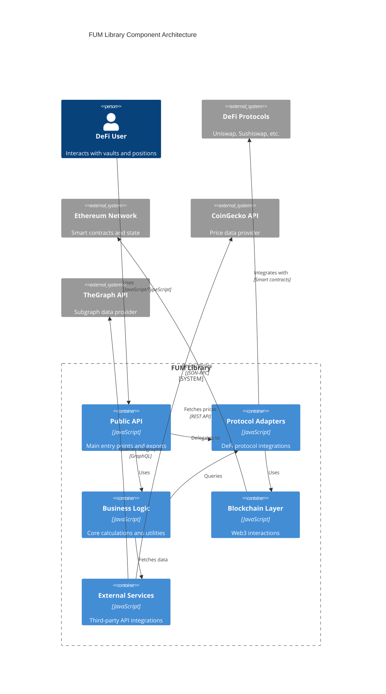
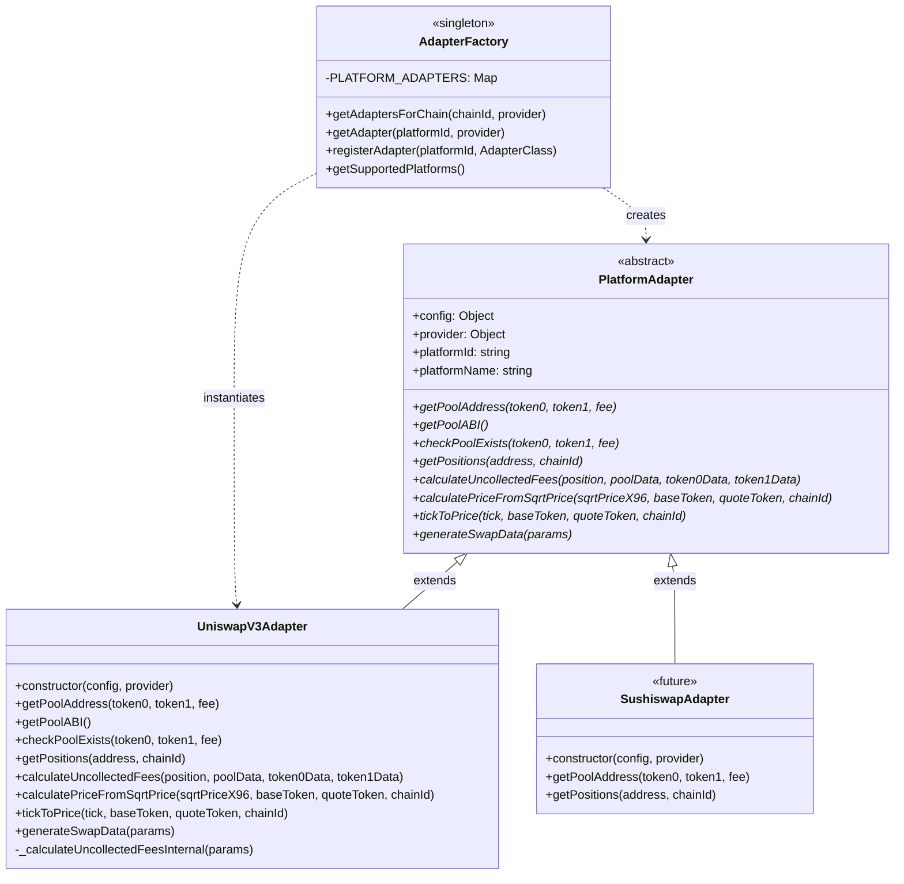
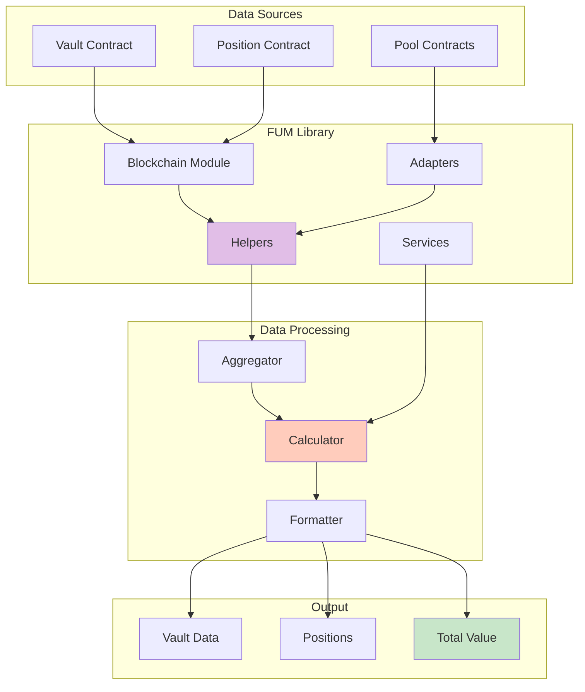
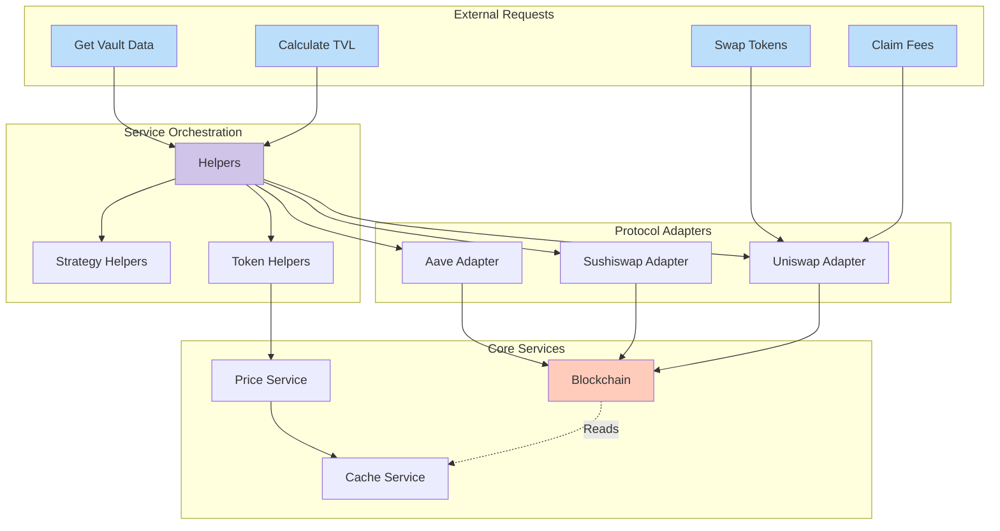
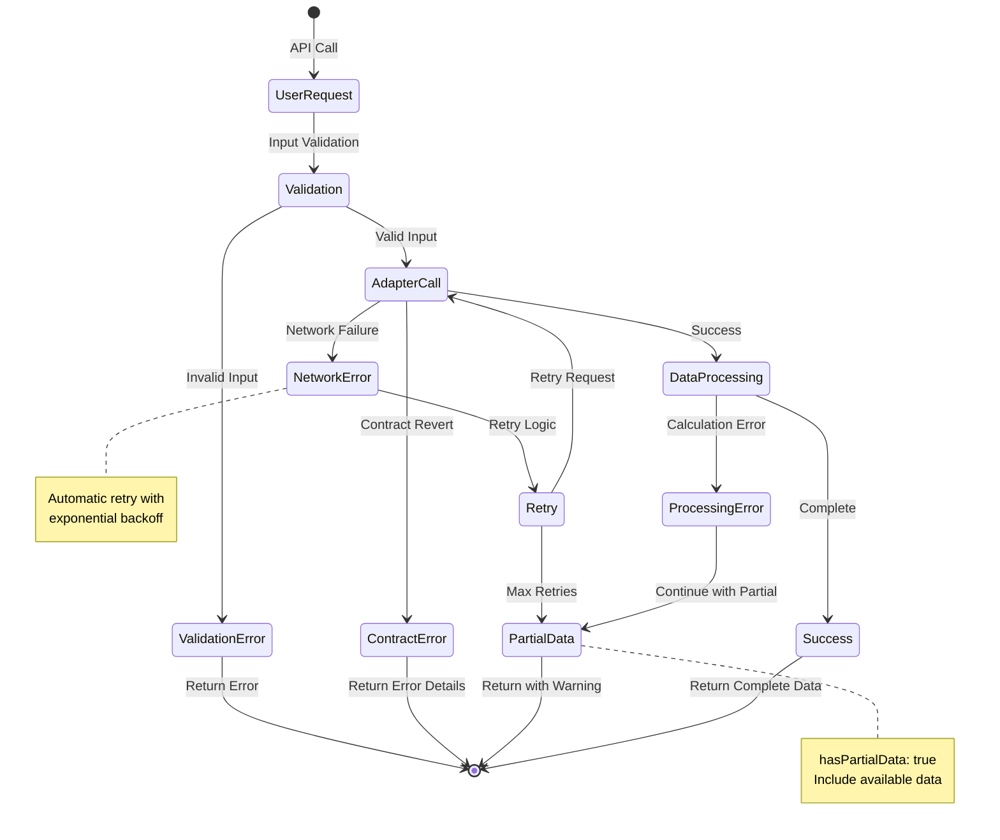

# Component Interaction Diagrams

## High-Level Component Architecture

```mermaid
C4Context
    title FUM Library Component Architecture
    
    Person(user, "DeFi User", "Interacts with vaults and positions")
    
    System_Boundary(fum, "FUM Library") {
        Container(api, "Public API", "JavaScript", "Main entry points and exports")
        Container(adapters, "Protocol Adapters", "JavaScript", "DeFi protocol integrations")
        Container(helpers, "Business Logic", "JavaScript", "Core calculations and utilities")
        Container(blockchain, "Blockchain Layer", "JavaScript", "Web3 interactions")
        Container(services, "External Services", "JavaScript", "Third-party API integrations")
    }
    
    System_Ext(defi, "DeFi Protocols", "Uniswap, Sushiswap, etc.")
    System_Ext(ethereum, "Ethereum Network", "Smart contracts and state")
    System_Ext(coingecko, "CoinGecko API", "Price data provider")
    System_Ext(thegraph, "TheGraph API", "Subgraph data provider")

    Rel(user, api, "Uses", "JavaScript/TypeScript")
    Rel(api, adapters, "Delegates to")
    Rel(api, helpers, "Uses")
    Rel(adapters, blockchain, "Uses")
    Rel(helpers, adapters, "Queries")
    Rel(helpers, services, "Fetches data")
    Rel(blockchain, ethereum, "Reads/Writes", "JSON-RPC")
    Rel(adapters, defi, "Integrates with", "Smart contracts")
    Rel(services, coingecko, "Fetches prices", "REST API")
    Rel(services, thegraph, "Queries subgraphs", "GraphQL")
```

## Adapter Pattern Implementation

```mermaid
classDiagram
    class PlatformAdapter {
        <<abstract>>
        +config: Object
        +provider: Object
        +platformId: string
        +platformName: string
        +getPoolAddress(token0, token1, fee)*
        +getPoolABI()*
        +checkPoolExists(token0, token1, fee)*
        +getPositions(address, chainId)*
        +calculateUncollectedFees(position, poolData, token0Data, token1Data)*
        +calculatePriceFromSqrtPrice(sqrtPriceX96, baseToken, quoteToken, chainId)*
        +tickToPrice(tick, baseToken, quoteToken, chainId)*
        +generateSwapData(params)*
    }
    
    class UniswapV3Adapter {
        +constructor(config, provider)
        +getPoolAddress(token0, token1, fee)
        +getPoolABI()
        +checkPoolExists(token0, token1, fee)
        +getPositions(address, chainId)
        +calculateUncollectedFees(position, poolData, token0Data, token1Data)
        +calculatePriceFromSqrtPrice(sqrtPriceX96, baseToken, quoteToken, chainId)
        +tickToPrice(tick, baseToken, quoteToken, chainId)
        +generateSwapData(params)
        -_calculateUncollectedFeesInternal(params)
    }
    
    class AdapterFactory {
        <<singleton>>
        -PLATFORM_ADAPTERS: Map
        +getAdaptersForChain(chainId, provider)
        +getAdapter(platformId, provider)
        +registerAdapter(platformId, AdapterClass)
        +getSupportedPlatforms()
    }
    
    class SushiswapAdapter {
        <<future>>
        +constructor(config, provider)
        +getPoolAddress(token0, token1, fee)
        +getPositions(address, chainId)
    }
    
    PlatformAdapter <|-- UniswapV3Adapter : extends
    PlatformAdapter <|-- SushiswapAdapter : extends
    AdapterFactory ..> PlatformAdapter : creates
    AdapterFactory ..> UniswapV3Adapter : instantiates
```

## Vault Data Aggregation

```mermaid
flowchart TB
    subgraph "Data Sources"
        VC[Vault Contract]
        PC[Position Contract]
        PoolC[Pool Contracts]
    end
    
    subgraph "FUM Library"
        HLP[Helpers]
        AD[Adapters]
        BC[Blockchain Module]
        SVC[Services]
    end
    
    subgraph "Data Processing"
        AGG[Aggregator]
        CALC[Calculator]
        FORMAT[Formatter]
    end
    
    subgraph "Output"
        VD[Vault Data]
        POS[Positions]
        TVL[Total Value]
    end
    
    VC --> BC
    PC --> BC
    PoolC --> AD
    
    BC --> HLP
    AD --> HLP
    HLP --> AGG
    
    AGG --> CALC
    SVC --> CALC
    CALC --> FORMAT
    
    FORMAT --> VD
    FORMAT --> POS
    FORMAT --> TVL
    
    style HLP fill:#e1bee7
    style CALC fill:#ffccbc
    style TVL fill:#c8e6c9
```

## Service Layer Interactions

```mermaid
graph TB
    subgraph "External Requests"
        R1[Get Vault Data]
        R2[Calculate TVL]
        R3[Swap Tokens]
        R4[Claim Fees]
    end
    
    subgraph "Service Orchestration"
        HLP[Helpers]
        TH[Token Helpers]
        SH[Strategy Helpers]
    end
    
    subgraph "Protocol Adapters"
        UA[Uniswap Adapter]
        SA[Sushiswap Adapter]
        AA[Aave Adapter]
    end
    
    subgraph "Core Services"
        BC[Blockchain]
        PS[Price Service]
        CS[Cache Service]
    end
    
    R1 --> HLP
    R2 --> HLP
    R3 --> UA
    R4 --> UA
    
    HLP --> UA
    HLP --> SA
    HLP --> AA
    HLP --> TH
    HLP --> SH
    
    UA --> BC
    SA --> BC
    AA --> BC
    
    TH --> PS
    PS --> CS
    
    BC -.->|Reads| CS
    
    style R1 fill:#bbdefb
    style R2 fill:#bbdefb
    style R3 fill:#bbdefb
    style R4 fill:#bbdefb
    style HLP fill:#d1c4e9
    style BC fill:#ffccbc
```

## Error Propagation Flow

```mermaid
stateDiagram-v2
    [*] --> UserRequest: API Call
    
    UserRequest --> Validation: Input Validation
    
    Validation --> ValidationError: Invalid Input
    ValidationError --> [*]: Return Error
    
    Validation --> AdapterCall: Valid Input
    
    AdapterCall --> NetworkError: Network Failure
    NetworkError --> Retry: Retry Logic
    Retry --> AdapterCall: Retry Request
    Retry --> PartialData: Max Retries
    
    AdapterCall --> ContractError: Contract Revert
    ContractError --> [*]: Return Error Details
    
    AdapterCall --> DataProcessing: Success
    
    DataProcessing --> ProcessingError: Calculation Error
    ProcessingError --> PartialData: Continue with Partial
    
    DataProcessing --> Success: Complete
    
    PartialData --> [*]: Return with Warning
    Success --> [*]: Return Complete Data
    
    note right of NetworkError
        Automatic retry with
        exponential backoff
    end note
    
    note right of PartialData
        hasPartialData: true
        Include available data
    end note
```