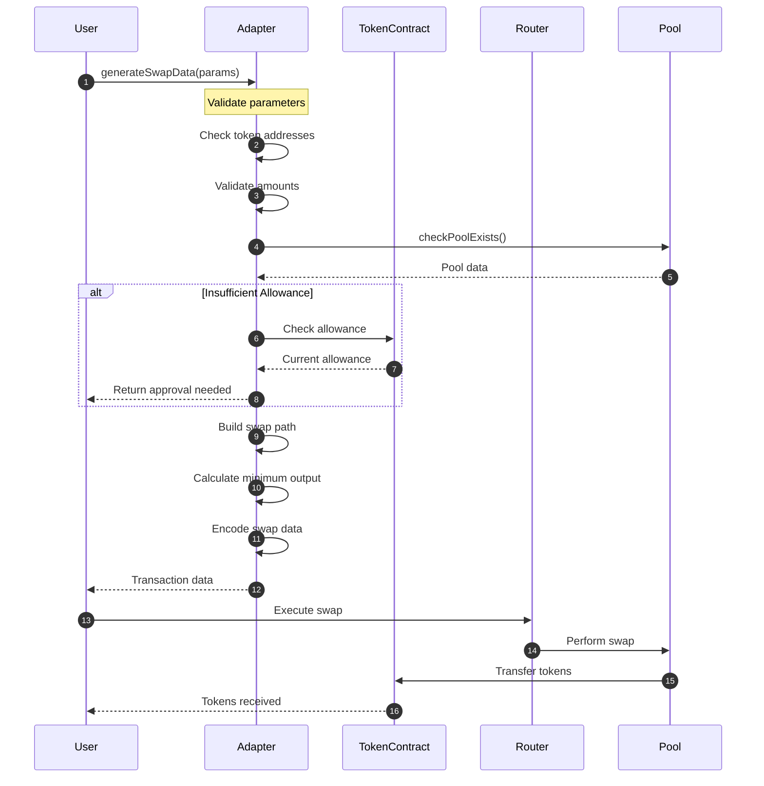
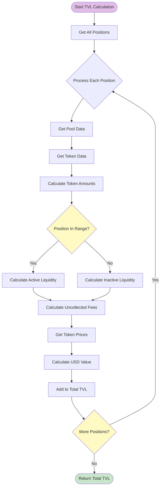
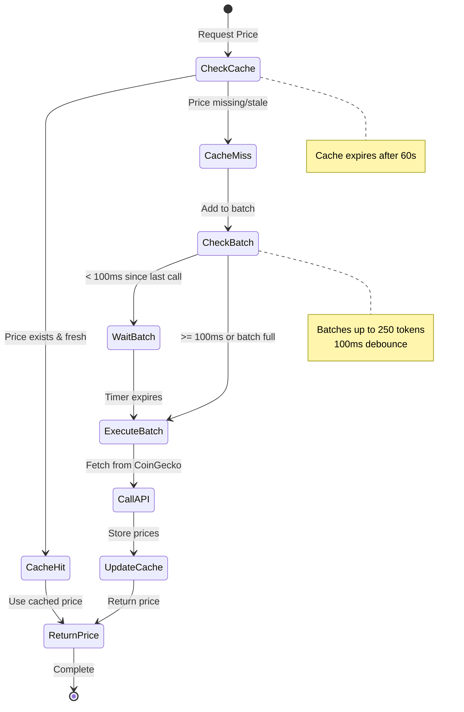
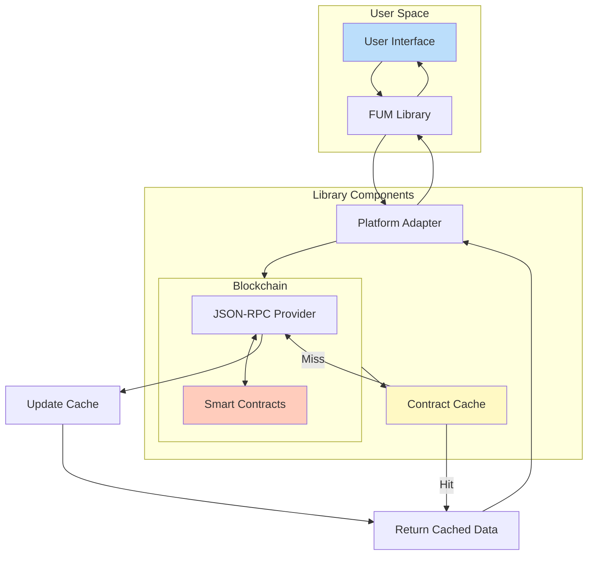

# Data Flow Diagrams

## Position Fetching Data Flow

```mermaid
flowchart LR
    Start([User Request]) --> GetVaults[Get User Vaults]
    GetVaults --> VaultLoop{For Each Vault}
    
    VaultLoop --> GetStrategy[Get Strategy Info]
    GetStrategy --> GetPositions[Get Positions]
    GetPositions --> GetPoolData[Get Pool Data]
    GetPoolData --> GetTokenData[Get Token Data]
    
    GetTokenData --> CalcAmounts[Calculate Token Amounts]
    CalcAmounts --> CalcFees[Calculate Fees]
    CalcFees --> FetchPrices[Fetch Token Prices]
    
    FetchPrices --> CheckCache{Price in Cache?}
    CheckCache -->|Yes| UseCached[Use Cached Price]
    CheckCache -->|No| CallAPI[Call CoinGecko API]
    CallAPI --> UpdateCache[Update Cache]
    UpdateCache --> UseCached
    
    UseCached --> CalcTVL[Calculate TVL]
    CalcTVL --> NextVault{More Vaults?}
    NextVault -->|Yes| VaultLoop
    NextVault -->|No| AggregateData[Aggregate All Data]
    AggregateData --> End([Return Results])
    
    style Start fill:#90caf9
    style End fill:#a5d6a7
    style CheckCache fill:#fff59d
    style NextVault fill:#fff59d
```

## Token Swap Flow

```mermaid
sequenceDiagram
    autonumber
    participant User
    participant Adapter
    participant TokenContract
    participant Router
    participant Pool
    
    User->>Adapter: generateSwapData(params)
    
    Note over Adapter: Validate parameters
    Adapter->>Adapter: Check token addresses
    Adapter->>Adapter: Validate amounts
    
    Adapter->>Pool: checkPoolExists()
    Pool-->>Adapter: Pool data
    
    alt Insufficient Allowance
        Adapter->>TokenContract: Check allowance
        TokenContract-->>Adapter: Current allowance
        Adapter-->>User: Return approval needed
    end
    
    Adapter->>Adapter: Build swap path
    Adapter->>Adapter: Calculate minimum output
    Adapter->>Adapter: Encode swap data
    
    Adapter-->>User: Transaction data
    
    User->>Router: Execute swap
    Router->>Pool: Perform swap
    Pool->>TokenContract: Transfer tokens
    TokenContract-->>User: Tokens received
```

## TVL Calculation Flow

```mermaid
flowchart TD
    Start([Start TVL Calculation]) --> GetPositions[Get All Positions]
    
    GetPositions --> ProcessPosition{Process Each Position}
    
    ProcessPosition --> GetPool[Get Pool Data]
    GetPool --> GetTokens[Get Token Data]
    GetTokens --> CalcAmounts[Calculate Token Amounts]
    
    CalcAmounts --> InRange{Position In Range?}
    InRange -->|Yes| CalcActive[Calculate Active Liquidity]
    InRange -->|No| CalcInactive[Calculate Inactive Liquidity]
    
    CalcActive --> CalcFees[Calculate Uncollected Fees]
    CalcInactive --> CalcFees
    
    CalcFees --> GetPrices[Get Token Prices]
    GetPrices --> CalcValue[Calculate USD Value]
    
    CalcValue --> AddToTotal[Add to Total TVL]
    AddToTotal --> MorePositions{More Positions?}
    
    MorePositions -->|Yes| ProcessPosition
    MorePositions -->|No| ReturnTVL([Return Total TVL])
    
    style Start fill:#e1bee7
    style ReturnTVL fill:#c8e6c9
    style InRange fill:#fff9c4
    style MorePositions fill:#fff9c4
```

## Price Fetching with Cache Flow

```mermaid
stateDiagram-v2
    [*] --> CheckCache: Request Price
    
    CheckCache --> CacheHit: Price exists & fresh
    CheckCache --> CacheMiss: Price missing/stale
    
    CacheHit --> ReturnPrice: Use cached price
    
    CacheMiss --> CheckBatch: Add to batch
    CheckBatch --> WaitBatch: < 100ms since last call
    CheckBatch --> ExecuteBatch: >= 100ms or batch full
    
    WaitBatch --> ExecuteBatch: Timer expires
    
    ExecuteBatch --> CallAPI: Fetch from CoinGecko
    CallAPI --> UpdateCache: Store prices
    UpdateCache --> ReturnPrice: Return price
    
    ReturnPrice --> [*]: Complete
    
    note right of CheckCache
        Cache expires after 60s
    end note
    
    note right of CheckBatch
        Batches up to 250 tokens
        100ms debounce
    end note
```

## Contract Interaction Flow

```mermaid
flowchart TB
    subgraph User Space
        UI[User Interface]
        Lib[FUM Library]
    end
    
    subgraph Library Components
        Adapter[Platform Adapter]
        Blockchain[Blockchain Module]
        Cache[Contract Cache]
    end
    
    subgraph Blockchain
        Provider[JSON-RPC Provider]
        Contracts[Smart Contracts]
    end
    
    UI --> Lib
    Lib --> Adapter
    
    Adapter --> Blockchain
    Blockchain --> Cache
    
    Cache -->|Hit| ReturnData[Return Cached Data]
    Cache -->|Miss| Provider
    
    Provider <--> Contracts
    Provider --> UpdateCache[Update Cache]
    UpdateCache --> ReturnData
    
    ReturnData --> Adapter
    Adapter --> Lib
    Lib --> UI
    
    style UI fill:#bbdefb
    style Contracts fill:#ffccbc
    style Cache fill:#fff9c4
```