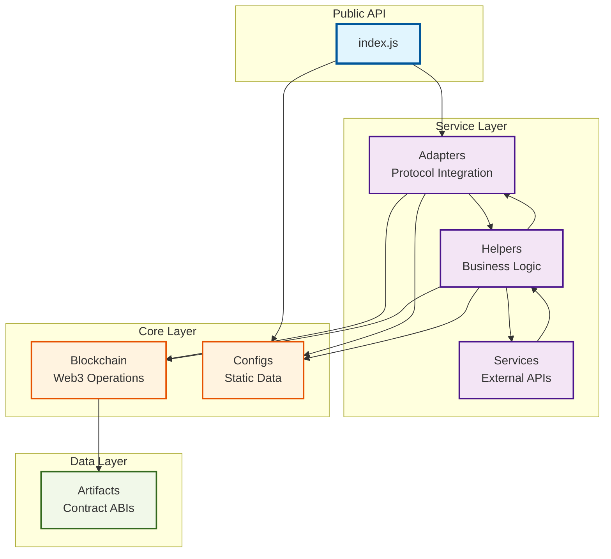

# Module Dependencies Diagram

## Complete Module Dependency Graph

```mermaid
graph TD
    %% Entry Point
    Index[index.js<br/>Main Entry]
    
    %% Adapters Module
    AdaptersIndex[adapters/index.js]
    AdapterFactory[AdapterFactory.js]
    PlatformAdapter[PlatformAdapter.js]
    UniswapV3Adapter[UniswapV3Adapter.js]
    
    %% Blockchain Module  
    BlockchainIndex[blockchain/index.js]
    Wallet[wallet.js]
    Contracts[contracts.js]
    
    %% Configs Module
    ConfigsIndex[configs/index.js]
    Chains[chains.js]
    Platforms[platforms.js]
    Strategies[strategies.js]
    Tokens[tokens.js]
    
    %% Helpers Module
    HelpersIndex[helpers/index.js]
    ChainHelpers[chainHelpers.js]
    FormatHelpers[formatHelpers.js]
    PlatformHelpers[platformHelpers.js]
    StrategyHelpers[strategyHelpers.js]
    TokenHelpers[tokenHelpers.js]
    
    %% Services Module
    ServicesIndex[services/index.js]
    Coingecko[coingecko.js]
    TheGraph[theGraph.js]
    
    %% Artifacts
    Artifacts[artifacts/contracts.js]
    
    %% Dependencies
    Index --> AdaptersIndex
    Index --> ConfigsIndex
    
    AdaptersIndex --> AdapterFactory
    AdaptersIndex --> PlatformAdapter
    AdaptersIndex --> UniswapV3Adapter
    
    AdapterFactory --> UniswapV3Adapter
    AdapterFactory --> Chains
    
    UniswapV3Adapter --> PlatformAdapter
    UniswapV3Adapter --> FormatHelpers
    UniswapV3Adapter -.->|external| EthersJS[ethers.js]
    UniswapV3Adapter -.->|external| UniswapSDK[@uniswap/v3-sdk]
    
    BlockchainIndex --> Wallet
    BlockchainIndex --> Contracts
    
    Contracts --> Artifacts
    Contracts -.->|external| EthersJS
    
    ConfigsIndex --> Chains
    ConfigsIndex --> Platforms
    ConfigsIndex --> Strategies
    ConfigsIndex --> Tokens
    
    HelpersIndex --> ChainHelpers
    HelpersIndex --> FormatHelpers
    HelpersIndex --> PlatformHelpers
    HelpersIndex --> StrategyHelpers
    HelpersIndex --> TokenHelpers

    ChainHelpers --> Chains

    PlatformHelpers --> Platforms
    PlatformHelpers --> ChainHelpers

    StrategyHelpers --> Strategies

    TokenHelpers --> Tokens

    ServicesIndex --> Coingecko
    ServicesIndex --> TheGraph

    Coingecko --> TokenHelpers
    
    %% Styling
    classDef entryPoint fill:#f9f,stroke:#333,stroke-width:4px
    classDef adapter fill:#bbf,stroke:#333,stroke-width:2px
    classDef helper fill:#bfb,stroke:#333,stroke-width:2px
    classDef config fill:#fbf,stroke:#333,stroke-width:2px
    classDef service fill:#ffb,stroke:#333,stroke-width:2px
    classDef external fill:#ddd,stroke:#333,stroke-width:1px,stroke-dasharray: 5 5
    
    class Index entryPoint
    class AdaptersIndex,AdapterFactory,PlatformAdapter,UniswapV3Adapter adapter
    class HelpersIndex,ChainHelpers,FormatHelpers,PlatformHelpers,StrategyHelpers,TokenHelpers helper
    class ConfigsIndex,Chains,Platforms,Strategies,Tokens,Artifacts config
    class ServicesIndex,Coingecko,TheGraph service
    class EthersJS,UniswapSDK external
```

## Simplified Module Relationships

