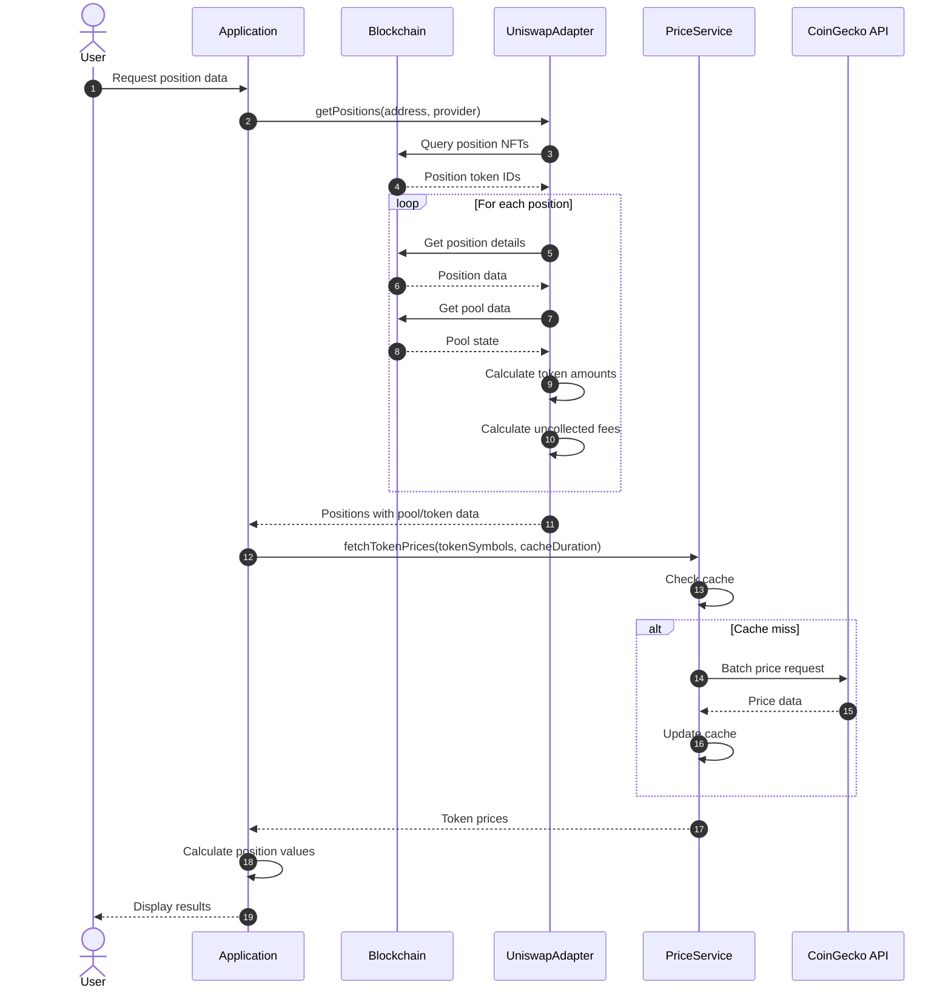
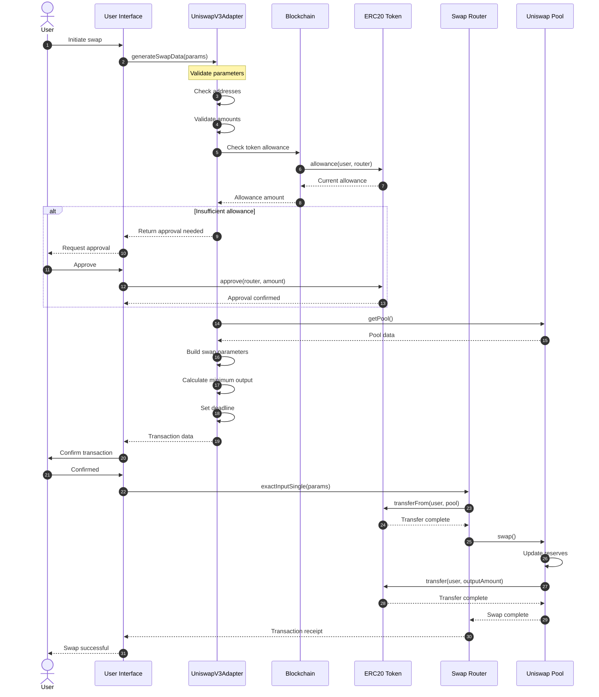
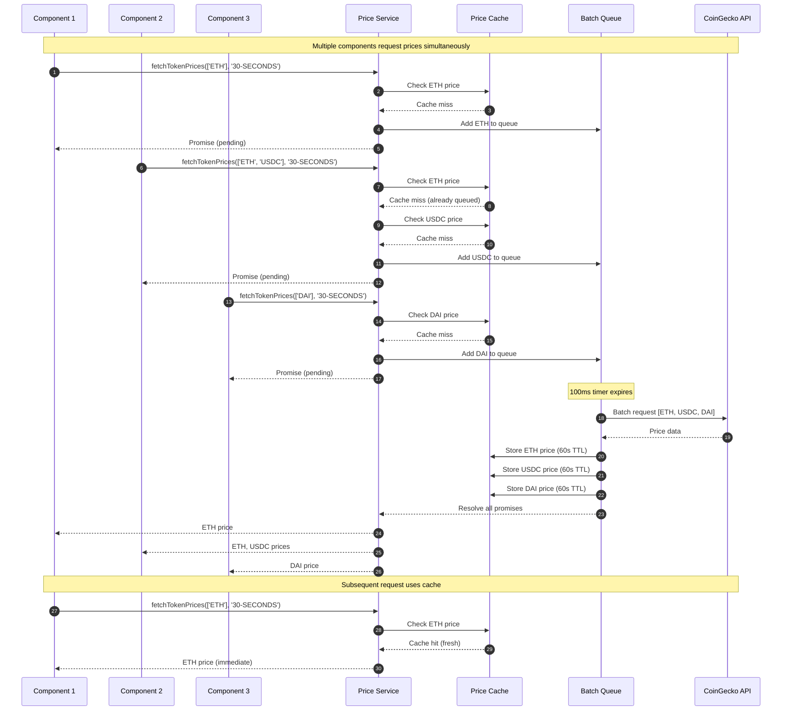

# Sequence Diagrams

## Complete Position Data Fetching Sequence

```mermaid
sequenceDiagram
    autonumber
    actor User
    participant App as Application
    participant BC as Blockchain
    participant UA as UniswapAdapter
    participant PS as PriceService
    participant CG as CoinGecko API

    User->>App: Request position data
    App->>UA: getPositions(address, provider)

    UA->>BC: Query position NFTs
    BC-->>UA: Position token IDs

    loop For each position
        UA->>BC: Get position details
        BC-->>UA: Position data
        UA->>BC: Get pool data
        BC-->>UA: Pool state
        UA->>UA: Calculate token amounts
        UA->>UA: Calculate uncollected fees
    end

    UA-->>App: Positions with pool/token data

    App->>PS: fetchTokenPrices(tokenSymbols, cacheDuration)
    PS->>PS: Check cache

    alt Cache miss
        PS->>CG: Batch price request
        CG-->>PS: Price data
        PS->>PS: Update cache
    end

    PS-->>App: Token prices
    App->>App: Calculate position values
    App-->>User: Display results
```

## Token Swap Execution Sequence

```mermaid
sequenceDiagram
    autonumber
    actor User
    participant UI as User Interface
    participant Adapter as UniswapV3Adapter
    participant BC as Blockchain
    participant Token as ERC20 Token
    participant Router as Swap Router
    participant Pool as Uniswap Pool
    
    User->>UI: Initiate swap
    UI->>Adapter: generateSwapData(params)
    
    Note over Adapter: Validate parameters
    Adapter->>Adapter: Check addresses
    Adapter->>Adapter: Validate amounts
    
    Adapter->>BC: Check token allowance
    BC->>Token: allowance(user, router)
    Token-->>BC: Current allowance
    BC-->>Adapter: Allowance amount
    
    alt Insufficient allowance
        Adapter-->>UI: Return approval needed
        UI-->>User: Request approval
        User->>UI: Approve
        UI->>Token: approve(router, amount)
        Token-->>UI: Approval confirmed
    end
    
    Adapter->>Pool: getPool()
    Pool-->>Adapter: Pool data
    
    Adapter->>Adapter: Build swap parameters
    Adapter->>Adapter: Calculate minimum output
    Adapter->>Adapter: Set deadline
    
    Adapter-->>UI: Transaction data
    UI->>User: Confirm transaction
    User->>UI: Confirmed
    
    UI->>Router: exactInputSingle(params)
    Router->>Token: transferFrom(user, pool)
    Token-->>Router: Transfer complete
    
    Router->>Pool: swap()
    Pool->>Pool: Update reserves
    Pool->>Token: transfer(user, outputAmount)
    Token-->>Pool: Transfer complete
    
    Pool-->>Router: Swap complete
    Router-->>UI: Transaction receipt
    UI-->>User: Swap successful
```

## Position Lifecycle

```mermaid
sequenceDiagram
    autonumber
    actor User
    participant App as Application
    participant Adapter as UniswapV3Adapter
    participant PM as Position Manager
    participant Pool as Liquidity Pool

    Note over User, Pool: Create Position

    User->>App: Create position request
    App->>Adapter: generateCreatePositionData(params)
    Adapter->>Adapter: Calculate tick range
    Adapter->>Adapter: Calculate liquidity
    Adapter-->>App: Transaction data
    App->>PM: mint(params)
    PM->>Pool: Add liquidity
    Pool-->>PM: Position created
    PM-->>User: Position NFT

    Note over User, Pool: Monitor Position

    User->>App: Get position data
    App->>Adapter: getPositions(address)
    Adapter->>PM: positions(tokenId)
    PM-->>Adapter: Position details
    Adapter->>Pool: slot0()
    Pool-->>Adapter: Current pool state
    Adapter->>Adapter: Calculate current value
    Adapter->>Adapter: Calculate fees earned
    Adapter-->>App: Position data
    App-->>User: Display position
    
    Note over User, Pool: Collect Fees
    
    User->>App: Collect fees request
    App->>Adapter: generateClaimFeesData(position)
    Adapter->>Adapter: Calculate fee amounts
    Adapter-->>App: Transaction data
    App->>PM: collect(params)
    PM->>Pool: Calculate fees owed
    Pool-->>PM: Fee amounts
    PM->>User: Transfer fees
    PM-->>User: Fees collected
    
    Note over User, Pool: Close Position
    
    User->>App: Close position request
    App->>Adapter: closePosition(params)
    
    Adapter->>Adapter: generateRemoveLiquidityData()
    Adapter->>PM: decreaseLiquidity(params)
    PM->>Pool: Remove liquidity
    Pool-->>PM: Tokens returned
    
    Adapter->>Adapter: generateClaimFeesData()
    Adapter->>PM: collect(params)
    PM-->>User: Remaining tokens + fees
    
    Adapter->>PM: burn(tokenId)
    PM-->>User: Position closed
```

## Price Caching Strategy

```mermaid
sequenceDiagram
    autonumber
    participant C1 as Component 1
    participant C2 as Component 2
    participant C3 as Component 3
    participant PS as Price Service
    participant Cache as Price Cache
    participant Batch as Batch Queue
    participant API as CoinGecko API
    
    Note over C1, API: Multiple components request prices simultaneously
    
    C1->>PS: fetchTokenPrices(['ETH'], '30-SECONDS')
    PS->>Cache: Check ETH price
    Cache-->>PS: Cache miss
    PS->>Batch: Add ETH to queue
    PS-->>C1: Promise (pending)
    
    C2->>PS: fetchTokenPrices(['ETH', 'USDC'], '30-SECONDS')
    PS->>Cache: Check ETH price
    Cache-->>PS: Cache miss (already queued)
    PS->>Cache: Check USDC price
    Cache-->>PS: Cache miss
    PS->>Batch: Add USDC to queue
    PS-->>C2: Promise (pending)
    
    C3->>PS: fetchTokenPrices(['DAI'], '30-SECONDS')
    PS->>Cache: Check DAI price
    Cache-->>PS: Cache miss
    PS->>Batch: Add DAI to queue
    PS-->>C3: Promise (pending)
    
    Note over Batch: 100ms timer expires
    
    Batch->>API: Batch request [ETH, USDC, DAI]
    API-->>Batch: Price data
    
    Batch->>Cache: Store ETH price (60s TTL)
    Batch->>Cache: Store USDC price (60s TTL)
    Batch->>Cache: Store DAI price (60s TTL)
    
    Batch-->>PS: Resolve all promises
    PS-->>C1: ETH price
    PS-->>C2: ETH, USDC prices
    PS-->>C3: DAI price
    
    Note over C1, API: Subsequent request uses cache
    
    C1->>PS: fetchTokenPrices(['ETH'], '30-SECONDS')
    PS->>Cache: Check ETH price
    Cache-->>PS: Cache hit (fresh)
    PS-->>C1: ETH price (immediate)
```