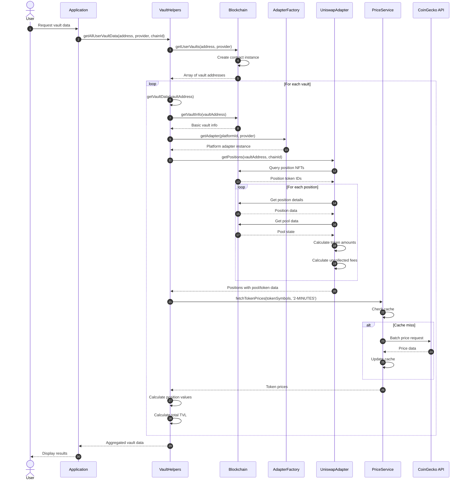
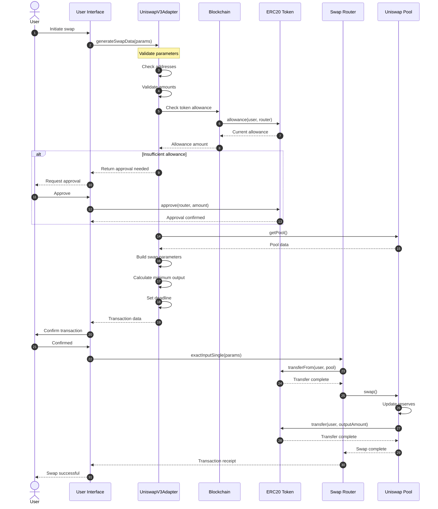
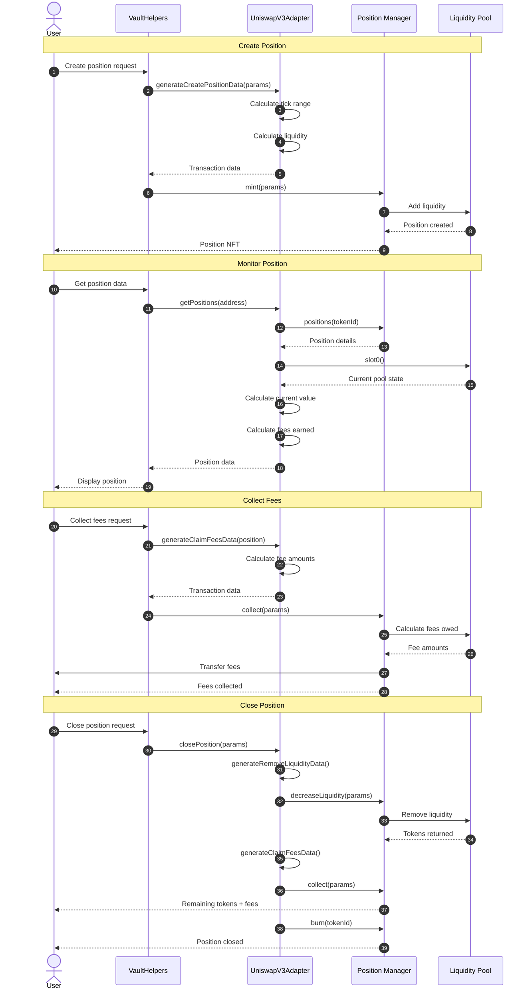
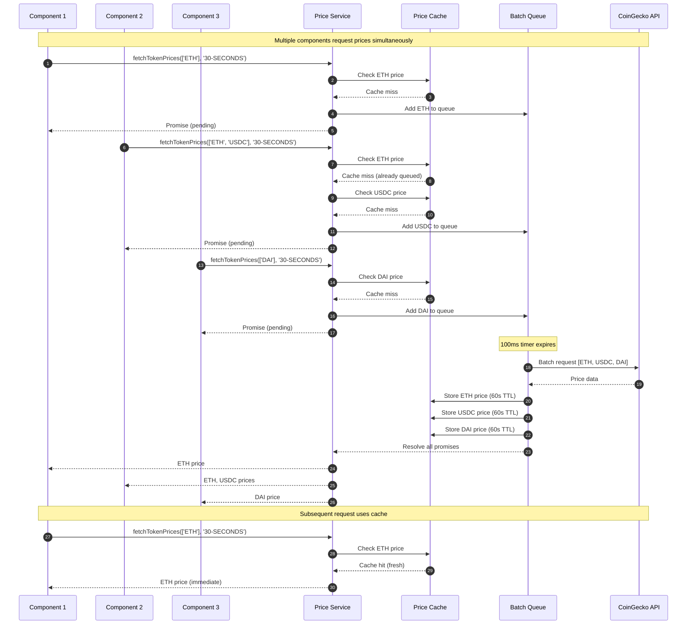

# Sequence Diagrams

## Complete Vault Data Fetching Sequence

```mermaid
sequenceDiagram
    autonumber
    actor User
    participant App as Application
    participant VH as VaultHelpers
    participant BC as Blockchain
    participant AF as AdapterFactory
    participant UA as UniswapAdapter
    participant PS as PriceService
    participant CG as CoinGecko API
    
    User->>App: Request vault data
    App->>VH: getAllUserVaultData(address, provider, chainId)
    
    VH->>BC: getUserVaults(address, provider)
    BC->>BC: Create contract instance
    BC-->>VH: Array of vault addresses
    
    loop For each vault
        VH->>VH: getVaultData(vaultAddress)
        VH->>BC: getVaultInfo(vaultAddress)
        BC-->>VH: Basic vault info
        
        VH->>AF: getAdapter(platformId, provider)
        AF-->>VH: Platform adapter instance
        
        VH->>UA: getPositions(vaultAddress, chainId)
        UA->>BC: Query position NFTs
        BC-->>UA: Position token IDs
        
        loop For each position
            UA->>BC: Get position details
            BC-->>UA: Position data
            UA->>BC: Get pool data
            BC-->>UA: Pool state
            UA->>UA: Calculate token amounts
            UA->>UA: Calculate uncollected fees
        end
        
        UA-->>VH: Positions with pool/token data
        
        VH->>PS: fetchTokenPrices(tokenSymbols, '2-MINUTES')
        PS->>PS: Check cache
        
        alt Cache miss
            PS->>CG: Batch price request
            CG-->>PS: Price data
            PS->>PS: Update cache
        end
        
        PS-->>VH: Token prices
        
        VH->>VH: Calculate position values
        VH->>VH: Calculate total TVL
    end
    
    VH-->>App: Aggregated vault data
    App-->>User: Display results
```

## Token Swap Execution Sequence

```mermaid
sequenceDiagram
    autonumber
    actor User
    participant UI as User Interface
    participant Adapter as UniswapV3Adapter
    participant BC as Blockchain
    participant Token as ERC20 Token
    participant Router as Swap Router
    participant Pool as Uniswap Pool
    
    User->>UI: Initiate swap
    UI->>Adapter: generateSwapData(params)
    
    Note over Adapter: Validate parameters
    Adapter->>Adapter: Check addresses
    Adapter->>Adapter: Validate amounts
    
    Adapter->>BC: Check token allowance
    BC->>Token: allowance(user, router)
    Token-->>BC: Current allowance
    BC-->>Adapter: Allowance amount
    
    alt Insufficient allowance
        Adapter-->>UI: Return approval needed
        UI-->>User: Request approval
        User->>UI: Approve
        UI->>Token: approve(router, amount)
        Token-->>UI: Approval confirmed
    end
    
    Adapter->>Pool: getPool()
    Pool-->>Adapter: Pool data
    
    Adapter->>Adapter: Build swap parameters
    Adapter->>Adapter: Calculate minimum output
    Adapter->>Adapter: Set deadline
    
    Adapter-->>UI: Transaction data
    UI->>User: Confirm transaction
    User->>UI: Confirmed
    
    UI->>Router: exactInputSingle(params)
    Router->>Token: transferFrom(user, pool)
    Token-->>Router: Transfer complete
    
    Router->>Pool: swap()
    Pool->>Pool: Update reserves
    Pool->>Token: transfer(user, outputAmount)
    Token-->>Pool: Transfer complete
    
    Pool-->>Router: Swap complete
    Router-->>UI: Transaction receipt
    UI-->>User: Swap successful
```

## Position Lifecycle

```mermaid
sequenceDiagram
    autonumber
    actor User
    participant VH as VaultHelpers
    participant Adapter as UniswapV3Adapter
    participant PM as Position Manager
    participant Pool as Liquidity Pool
    
    Note over User, Pool: Create Position
    
    User->>VH: Create position request
    VH->>Adapter: generateCreatePositionData(params)
    Adapter->>Adapter: Calculate tick range
    Adapter->>Adapter: Calculate liquidity
    Adapter-->>VH: Transaction data
    VH->>PM: mint(params)
    PM->>Pool: Add liquidity
    Pool-->>PM: Position created
    PM-->>User: Position NFT
    
    Note over User, Pool: Monitor Position
    
    User->>VH: Get position data
    VH->>Adapter: getPositions(address)
    Adapter->>PM: positions(tokenId)
    PM-->>Adapter: Position details
    Adapter->>Pool: slot0()
    Pool-->>Adapter: Current pool state
    Adapter->>Adapter: Calculate current value
    Adapter->>Adapter: Calculate fees earned
    Adapter-->>VH: Position data
    VH-->>User: Display position
    
    Note over User, Pool: Collect Fees
    
    User->>VH: Collect fees request
    VH->>Adapter: generateClaimFeesData(position)
    Adapter->>Adapter: Calculate fee amounts
    Adapter-->>VH: Transaction data
    VH->>PM: collect(params)
    PM->>Pool: Calculate fees owed
    Pool-->>PM: Fee amounts
    PM->>User: Transfer fees
    PM-->>User: Fees collected
    
    Note over User, Pool: Close Position
    
    User->>VH: Close position request
    VH->>Adapter: closePosition(params)
    
    Adapter->>Adapter: generateRemoveLiquidityData()
    Adapter->>PM: decreaseLiquidity(params)
    PM->>Pool: Remove liquidity
    Pool-->>PM: Tokens returned
    
    Adapter->>Adapter: generateClaimFeesData()
    Adapter->>PM: collect(params)
    PM-->>User: Remaining tokens + fees
    
    Adapter->>PM: burn(tokenId)
    PM-->>User: Position closed
```

## Price Caching Strategy

```mermaid
sequenceDiagram
    autonumber
    participant C1 as Component 1
    participant C2 as Component 2
    participant C3 as Component 3
    participant PS as Price Service
    participant Cache as Price Cache
    participant Batch as Batch Queue
    participant API as CoinGecko API
    
    Note over C1, API: Multiple components request prices simultaneously
    
    C1->>PS: fetchTokenPrices(['ETH'], '30-SECONDS')
    PS->>Cache: Check ETH price
    Cache-->>PS: Cache miss
    PS->>Batch: Add ETH to queue
    PS-->>C1: Promise (pending)
    
    C2->>PS: fetchTokenPrices(['ETH', 'USDC'], '30-SECONDS')
    PS->>Cache: Check ETH price
    Cache-->>PS: Cache miss (already queued)
    PS->>Cache: Check USDC price
    Cache-->>PS: Cache miss
    PS->>Batch: Add USDC to queue
    PS-->>C2: Promise (pending)
    
    C3->>PS: fetchTokenPrices(['DAI'], '30-SECONDS')
    PS->>Cache: Check DAI price
    Cache-->>PS: Cache miss
    PS->>Batch: Add DAI to queue
    PS-->>C3: Promise (pending)
    
    Note over Batch: 100ms timer expires
    
    Batch->>API: Batch request [ETH, USDC, DAI]
    API-->>Batch: Price data
    
    Batch->>Cache: Store ETH price (60s TTL)
    Batch->>Cache: Store USDC price (60s TTL)
    Batch->>Cache: Store DAI price (60s TTL)
    
    Batch-->>PS: Resolve all promises
    PS-->>C1: ETH price
    PS-->>C2: ETH, USDC prices
    PS-->>C3: DAI price
    
    Note over C1, API: Subsequent request uses cache
    
    C1->>PS: fetchTokenPrices(['ETH'], '30-SECONDS')
    PS->>Cache: Check ETH price
    Cache-->>PS: Cache hit (fresh)
    PS-->>C1: ETH price (immediate)
```